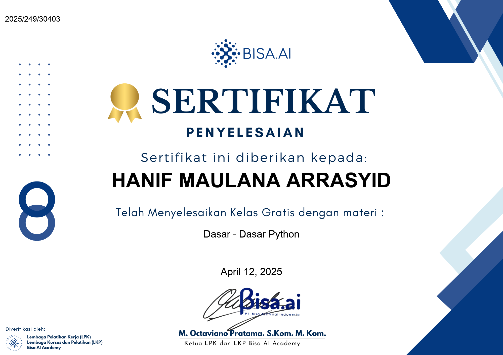

# 🐍 Python Dasar

Repositori ini berisi materi dasar Python untuk pemula yang mencakup topik-topik penting seperti variabel, operator, kontrol alur, fungsi, dan lainnya.

## 📚 Daftar Materi

### 01 - Pengenalan
- `01_hello_world.py`: Program Python pertama (Hello, World!).
- `02_komentar.py`: Cara menulis komentar dalam kode Python.

### 02 - Variabel dan Tipe Data
- `01_variabel.py`: Pendeklarasian variabel.
- `02_tipe_data_numerik.py`: Integer, float, dan operasi numerik.
- `03_tipe_data_string.py`: Manipulasi string.
- `04_tipe_data_boolean.py`: Tipe data boolean.
- `05_tipe_data_none.py`: Tipe data NoneType.

### 03 - Operator
- `01_operator_aritmatika.py`: Operator matematika dasar.
- `02_operator_perbandingan.py`: Operator perbandingan nilai.
- `03_operator_logika.py`: Operator logika (and, or, not).
- `04_operator_assignment.py`: Operator penugasan.
- `05_operator_identity_membership.py`: Operator identitas dan keanggotaan.

### 04 - Struktur Kontrol
- `01_if_else.py`: Percabangan `if`, `elif`, dan `else`.
- `02_match_case.py`: Penggunaan `match-case` (Python 3.10+).

### 05 - Perulangan
- `01_for_loop.py`: Looping menggunakan `for`.
- `02_while_loop.py`: Looping menggunakan `while`.
- `03_nested_loops.py`: Perulangan bersarang.
- `04_list_comprehensions.py`: List comprehensions.

### 06 - Fungsi
- `01_basic_function.py`: Membuat dan memanggil fungsi dasar.

### 07 - List dan Tuple
- `01_list_basics.py`: Dasar penggunaan list.
- `02_tuple_basics.py`: Dasar penggunaan tuple.

### 08 - Dictionary
- `01_basic_dict.py`: Penggunaan dictionary (key-value pair).

### 09 - Modul dan Package
- `01_import_module.py`: Cara mengimpor modul dalam Python.

### 10 - File Handling
- `01_read_file.py`: Membaca file dari file eksternal.

---

## 📚 Kursus Terkait

- [Dasar-dasar Python - Bisa.ai](https://bisa.ai/my_course/detail/1/128335)

## 🏆 Sertifikat

